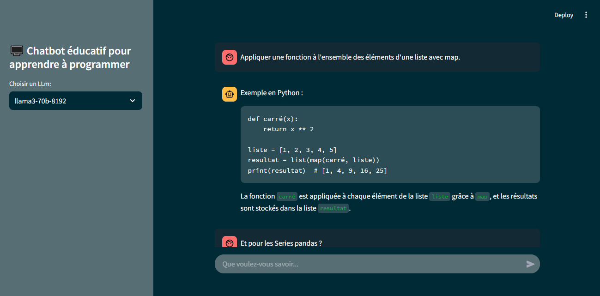

# Chatbot éducatif pour apprendre à programmer
Ce projet met en scène un chatbot construite avec Streamlit qui intègre les modèles Llama3 via la plateforme Groq. Il est conçu pour offrir des fonctionnalités de chat rapides et en temps réel pilotées par l’IA, en tirant le meilleur parti des capacités de Llama3 au sein d’une interface Web interactive.

## Fonctionnalités
- **Llama3 Integration**: Exploite le Llama3 et d’autres modèles majeurs, tels que Mixtral et DeepSeek, pour fournir des réponses intelligentes et contextuelles.
- **Groq Platform**: Utilise les puissantes capacités de calcul de Groq pour garantir des réponses rapides et efficaces du modèle.
- **Streamlit Interface**: Offre une interface Web conviviale qui permet aux utilisatrices d’interagir avec l’IA de manière dynamique.
- **Real-Time Responses**: Conçu pour gérer les entrées de l’utilisateur et fournir des réponses d’IA en temps réel.

## Technologies Utilisées
- Python 3.x
- Streamlit
- Groq API
- dotenv for environment management

## Getting Started

### Pré-requis
Assurez-vous que Python 3.10 ou une version ultérieure est installé sur votre système. Streamlit et les autres packages requis seront installés via le fichier requirements.txt.

### Installation
1. Cloner le repository:
    ```bash
    git clone https://github.com/Op27/llama3-groq-streamlit.git
    ```

2. Installer les packages python nécessaires :
    ```bash
    pip install -q -r requirements.txt
    ```

## Configuration
### Obtenir API Key de Groq
Pour utiliser cette application, vous aurez besoin d’une clé API de Groq. Visiter [Groq API documentation](https://console.groq.com/docs/quickstart) pour apprendre comment en obtenir une.

### Configurer l'environnement
Une fois que vous avez votre clé API, vous devez la définir dans votre environnement:
- Ouvrir le fichier `.env` et remplacer `VOTRE_CLE_API_ICI` avec votre clé API de Groq.

Cette étape est cruciale pour que l’application puisse interagir avec les services de Groq en toute sécurité.

## Lancer l'Application
Pour lancer l'application, exécutez la commande suivante dans votre terminal:
    ```bash
    streamlit run main.py
    ```

## License
Ce projet est sous licence MIT License - Voir le fichier [LICENSE](LICENSE) pour plus de details.

## Aperçu de l'application
